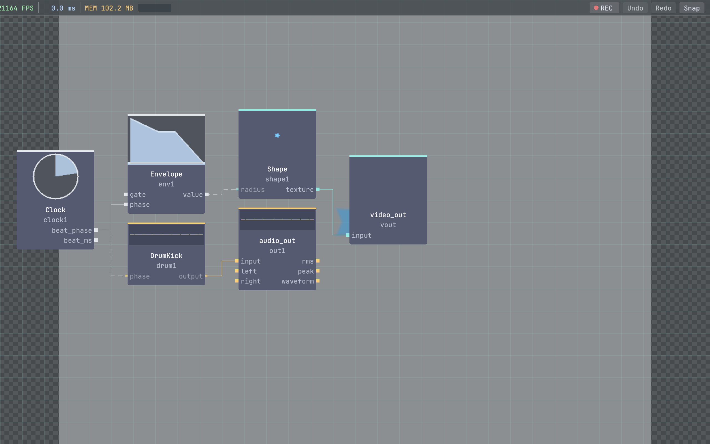

# vivid-drums

`vivid-drums` is a Vivid package library that provides drum synthesis operators.

## Preview



## Local install

```bash
./build/vivid link ../vivid-drums
./build/vivid rebuild vivid-drums
```

## Package contents

- `src/drum_kick.cpp`
- `src/drum_snare.cpp`
- `src/drum_hihat.cpp`
- `src/drum_clap.cpp`
- `src/drum_cymbal.cpp`
- `vivid-package.json`
